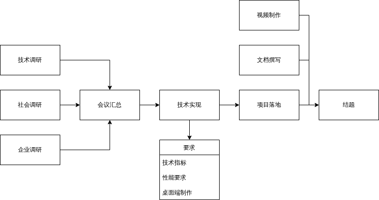

# 语音分割项目 12月分工规划 2021/11/30
## 分点
- 企业调研
  - 企业调研主要涉及企业相关信息搜集，较为轻松
  - 这一点调研主要是为了调查企业的兴趣，即他们做这个是为啥，我们应该怎么样做，才会使他们对我们的项目感兴趣
- 技术调研
  - 技术调研需要涉及最新的相关技术，阅读相关前沿的英文论文，并且做相关记录，任务较重且重要
  - 调研技术的同学需要记录下各个模型，对前沿技术了解，并且对目前工业界应用的算法了解
- 社会调研
  - 该项技术的社会应用调研
  - 负责该块的同学还应该考虑一下最终技术做出来之后，可以落地的一些项目作为我们的拓展

## 注意
- 调研时应保持记录，保留文档、文献等相关信息，方便以后材料的撰写
- 调研时间可以较长，考虑到12月事情很多，所以建议在 **1月12日** 前完成所有调研，并且于 **1月13日** 前将对应的文档上传至团队 [Git](https://github.com/Tworan/Wave-Split-CSU2021) 中的各个文件夹下
- 在所有资料和文档都上传完毕后，择期进行团队会议，主要进行技术方面接下来的分工和讨论
## 具体分工
- 企业调研 1人
- 技术调研 2~3人
- 社会调研 1人
## 解释
- 之所以推荐使用git还有记录文档，是为了方便以后材料的撰写，还有日后的讨论，因此有必要把所有材料和信息都记录和保存完整
## 整体项目流程

