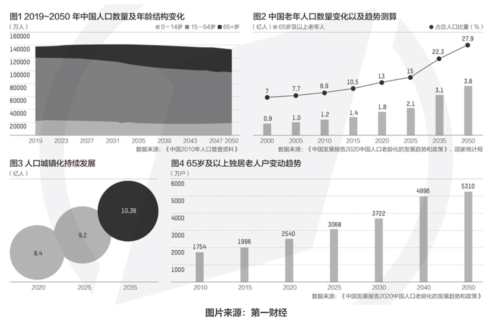
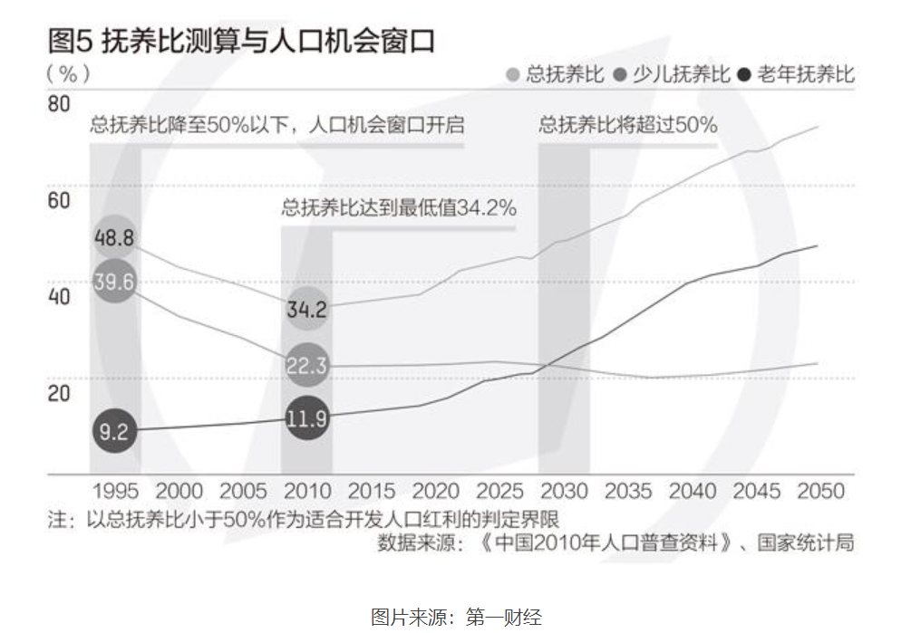

## 全国人口老龄化调研

1.  **全国人口老龄化情况**

根据国家统计局于2021年5月11日发布的《第七次全国人口普查公报（第五号）》，截至2020年11月1日零时，我国60岁及以上人口为264018766人，占总人口的18.70%，其中65岁及以上人口为190635280人，占13.50%。与2010年第六次全国人口普查相比，60岁及以上人口比重上升5.44个百分点，65岁及以上人口的比重上升4.63个百分点。

1.  **地区人口老龄化情况**

《第七次全国人口普查公报（第五号）》提到，31个省份中，
15—59岁人口比重在65%以上的省份有13个，在60%—65%之间的省份有15个，在60%以下的省份有3个。除西藏外，其他30个省份65岁及以上老年人口比重均超过7%，其中12个省份65岁及以上老年人口比重超过14%。

1.  **人口老龄化趋势**

根据中国发展研究基金会发布的《中国发展报告2020：中国人口老龄化的发展趋势和政策》（下称“报告”），中国人口老龄化程度会持续加深，到2035年和2050年时，中国65岁及以上的老年人将到达3.1亿和接近3.8亿，占总人口比例则分别达到22.3%和27.9%。如果以60岁及以上作为划定老年人口的标准，中国的老年人口数量将会更多，到2050年时将会有接近5亿老年人。

