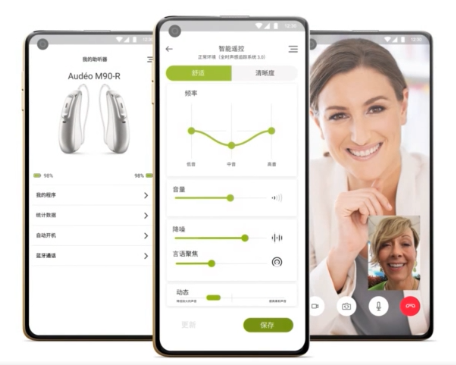

### 助听器APP调研

1.  **助听APP示例**

    1.  **智听**

        1.  简介

-   智听APP让“手机+普通耳机”实现助听功能。

-   把周围的声音收集过来，去掉噪音后，再通过耳机直播出来，帮助听障人士听得更清楚

-   支持蓝牙耳机话筒，走路时手机放到包里也可使用

-   支持突发大音量检测并实时降低音量，以保护听力

-   支持听力测试和多频段多通道响度补偿，让你随时了解自己的听力状况，并获得个人专属的声音效果

-   将手机内、外的语音同步转成文字，可谓影视节目添加实时字幕，也可辅助交流

-   重要场合可以启用录音以便事后回听

1.  个人实测

-   测试方法：在个人手机的应用商店中下载智听APP，连接蓝牙耳机，进行两种环境下的测试：

    -   环境一：在较为安静的宿舍内，让舍友一边制造噪音（晃动塑料袋）一边讲话

    -   环境二：在安静的宿舍内，使用电脑/iPad播放音乐，并且自己制造噪音（摇动椅子、敲桌子、手指划过桌面）

-   测试结果：

    -   在环境一中，使用后反而感觉噪声更大更刺耳

    -   在环境二中，在不制造噪音，仅仅使用播放器播放音乐的情况下，音乐中的人声分离效果良好，偶尔会听到突然的乐器声（鼓声等敲击类的乐器的声音一直都有，未能被消除），分离出来的人声比较稳定，略有失真，但不影响听懂；在制造噪音的情况下，同样是感觉噪音反而更加刺耳、更加影响人声

    -   测试结果可能有偏差

    1.  **Mobile ears**

        这款软件适合苹果手机用户，它对于轻度和中度的听力损失的用户效果比较明显，使用是只需要借助耳机就能让手机变成助听器，而不需要进行太多的测试或者借助其他的工具。

    2.  **Petralex**

借助有线耳机或者是蓝牙耳机就可以让手机变成助听器，它会从左声道播放声音，需要助听功能时按下红色的按钮，但其操作时需要先测试后调试，才能比较好的使用它。

1.  **亿耳助听**

只需要用软件加上手机，再经过简单的听力测试，就可以开始使用，它会自动根据测试的结果进行补偿，让听到的效果更加的清晰。

1.  **乐听**

专门为为有听力障碍的患者设计的智能助听器软件，它的延迟非常低，让沟通的时候不会出现延迟障碍，首年使用的时候是免费的。

1.  **Hear boost**

它可以让麦克风的拾取提高200倍，从而获得的声音信息更加准确和全面，用增强的方式去聆听周围的声音，并且有很强的录音功能。

1.  **助听器APP示例**

    1.  **峰力**

        myPhonak-app

-   通过手机蓝牙对**助听器**进行操作，支持安卓/IOS系统

-   智能遥控：通过选择程序或场景来调节和控制助听器，实现个性化设置；或通过高级设置，个性化定制助听器音质

-   远程验配：验配师远程帮助实时远程调节峰力助听器

-   我的助听器：收集助听器的使用数据，实时掌握助听器状态，分析助听器使用情况

图 1 myPhonak-app

1.  **瑞声达**

    1.  ReSound Control

-   支持安卓/IOS系统，需配合多功能手机伴侣[^1]使用

-   调节助听器音量

-   切换**助听器**聆听程序[^2]

-   自定义聆听程序

    1.  ReSound Smart

-   可通过手机蓝牙连接直接控制**助听器**，支持安卓/IOS系统

-   助听器定位和搜寻功能

-   静音功能

-   调节语言聚焦程度

-   高低音调节

-   调节风噪声下/噪声中的舒适度

-   调节助听器音量

-   切换助听器聆听程序

-   自定义聆听程序

-   无线连接状态显示

    1.  ReSound Smart3D

-   ReSound Smart的升级版，功能同ReSound Smart

[^1]: 手机伴侣是一款手机通过全球卫星[GPS定位](https://baike.baidu.com/item/GPS%E5%AE%9A%E4%BD%8D/3504691)追踪软件，主要应用于亲人（老人、小孩）的安全监护、定位追踪，只需要在手机上安装手机伴侣手机定位[追踪](https://baike.baidu.com/item/%E8%BF%BD%E8%B8%AA/44928)软件，就可以通过电脑或者手机随时随地查看到所持有手机的地理位置、短信内容、通话记录。

[^2]: 助听器有多个程序可以选择，如普通、安静、户外、噪音、听音乐、打电话等，一次可以设置
    6个聆听程序
    ，基本覆盖每个人的大部分生活场景，进入不同的场景，可以切换到对应的程序中（验配师预先调试保存好各项参数），这样就可以满足不同场景里佩戴舒适度、清晰度！

图 2 ReSound Smart3D

1.  **奥迪康**

    Oticon ON

-   通过手机蓝牙配对**助听器**，支持安卓/IOS系统

-   音量控制

-   程序选择

-   耳鸣掩蔽程序控制（音量、个性化耳鸣掩蔽声）

-   寻找助听器

-   助听器使用说明、如何应对听力损失

图 3 Oticon ON

1.  **SONIC**

    Soundlink app

-   通过手机蓝牙配对**助听器**，支持安卓/IOS系统

-   调节助听器音量

-   切换助听器聆听程序

-   个性化定制助听器聆听效果

图 4 Soundlink app
