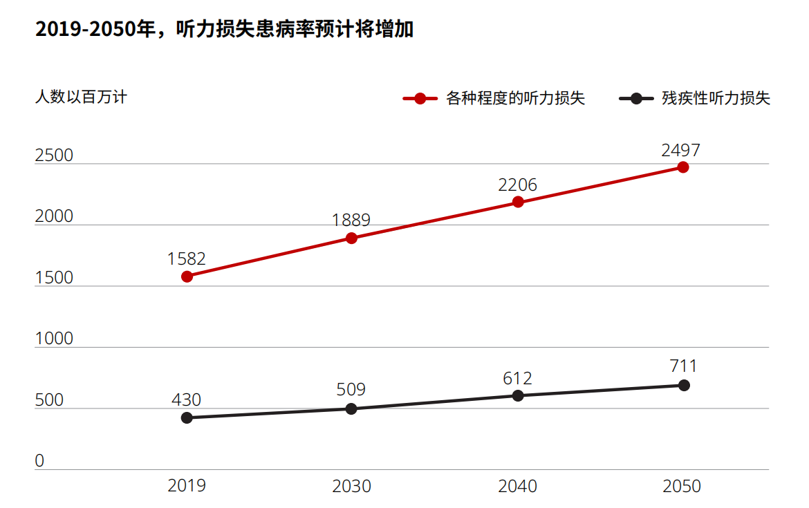

# 听力障碍相关调研

1.  **耳聋和听力损失概述**

    1.  耳聋和听力损失症状

        根据世界卫生组织的定义，如果一个人不能像听力正常的人一样听到声音（这意味着双耳的听力阈值达到20分贝或更高）即被称为听力损失。

        当好耳的听力阈值超过20分贝时，就可能在噪声环境下听不清谈话声；当好耳的听力阈值超过35分贝时，在安静的环境下也有可能听不清谈话声；而当好耳的听力阈值高于50分贝时，多数成年人在噪声环境下大部分谈话都很困难；当此阈值超过65分贝时，多数成年人在安静的环境下要听到谈话内容也相当困难，即使提高音量也不能改善，在噪声环境中，甚至连参与谈话都非常困难。

        现实中，有一部分人患有隐性听力损失，在安静的场景中，患者可以正常的与人交谈，但若把谈话转移到较为嘈杂的环境，患者便无法分辨出对方在说什么。隐性听力损失在2009年首次被准确的描述出来，目前尚不能准确的评估隐性听力损失的普遍程度。尽管患有隐性听力损失的风险似乎会随着年龄的增长而增加，但隐性听力损失往往比传统听力损失来的更早。

    2.  听力损失带来的负面影响

        听力损失带来的影响是广泛且深远的。听力损失会影响患者与他人的沟通能力，听力损失得不到治疗，可能会导致人们因沟通不力而遭到排斥，从而促发孤独感、挫折感和社会隔离感。对于儿童而言，听力损失会对儿童的发展和教育成绩产生重大影响；对于老年人来说，老年人的听力损失还和早期认知衰退和痴呆症有关。

1.  **我国乃至全球的听力损失人群概况**

    根据《中国听力健康报告（2021）》（以下简称“蓝皮书”），在我国的第二次全国残疾人抽样调查中，共调查0至14岁儿童479581人，其中听力障碍儿童共818人，现患率为0.17%，单纯听力障碍儿童共290人，现患率位0.06%。共调查15至24岁青少年共837429人，听力障碍青少年共1719人，现患率为0.21%，单纯听力障碍青少年共599人，现患率为0.07%。

    根据世界卫生组织在2021年发布的《世界听力报告》，目前全球约有4.3亿人因听力损失需要健康服务，预计到2050年，将近有25亿人患有某种程度的听力损失，其中至少7亿人需要康复服务。

    

    图 1 听力损失患病率预估

    人口统计和人口趋势反映了全球范围内生命全程中听力损失的高患病率。未来30年，听力受损者的人数可能会增加1.5倍以上，超过7亿人可能会经历中度或更严重的听力损失。

1.  **当下听力健康行业现状**

    1.  当下我国在听力健康行业人才培养和人力资本方面存在两个问题

        1.  听力学人才缺口较大且资源配置失衡。听力健康行业从业人员难以满足庞大的听力障碍康复需求，且区域发展不均衡等问题导致了听力健康资源配置的失衡，限制了我国听力学人才的培养和高质量发展。

        2.  听力学师资力量较为薄弱，从而导致听力健康行业从业人员普遍存在学历较低、资质不足、流动性大等问题，阻碍了行业的发展。

    2.  全球听力健康行业状况

        1.  在大多数国家，耳部和听力保健没有被纳入国家卫生体系，同时获得耳部和听力保健的情况没有很好的衡量和记录，卫生信息系统中往往缺乏相关指标。

        2.  全球听力保健行业的人力资源差距巨大。在低收入国家中，大约78%的国家每百万人中只有不到一名耳鼻喉专家；93%的国家每百万人中有不到一名听力矫治专家；只有17%的国家每百万人中有一名或多名语言治疗师；50%的国家每百万人中有一名或多名聋人教师。在能够受益于助听器的人中，只有17%的人实际上使用了助听器。
